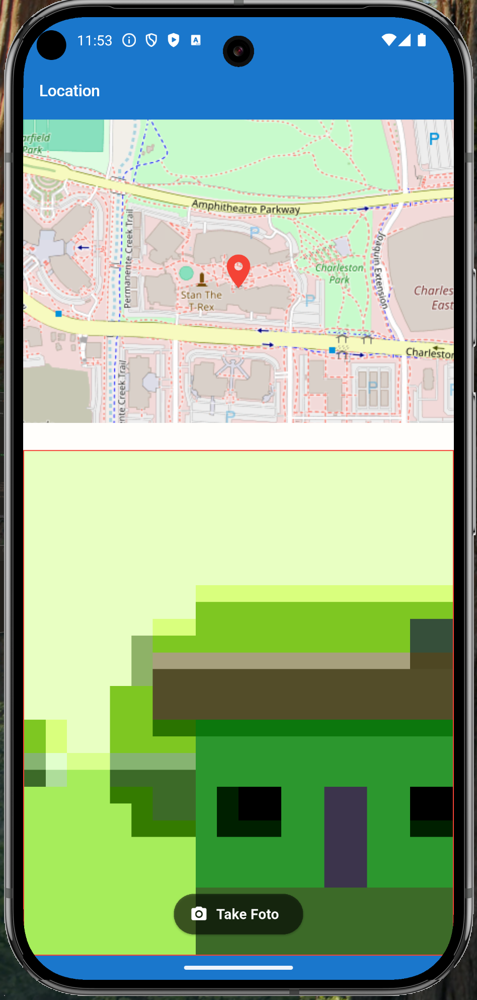
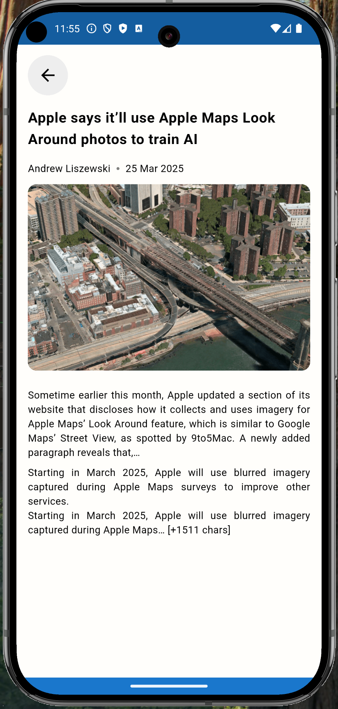

# geocam_news

# run aplikasi

Install Dependencies
Jalankan perintah berikut untuk mengunduh semua dependency:
flutter pub get

Generate Code (Jika Diperlukan)
Jika menggunakan library seperti freezed atau json_serializable, jalankan:
flutter pub run build_runner build --delete-conflicting-outputs

Build APK
Untuk membangun aplikasi Android:
flutter build apk

Run Aplikasi
Jalankan aplikasi di emulator atau perangkat fisik:
flutter run

# library

dio :
untuk network atau call api dan error handler api

bloc/cubit :
penggunaan state management dalam aplikasi flutter ini
get_storage :
Penyimpanan data lokal storage

intl :
initializeDateFormatting untuk mengatur format tanggal sesuai bahasa aplikasi.

freezed :
Digunakan untuk membuat kelas immutable dan union types.
Membantu menangani berbagai jenis error dengan cara yang lebih terstruktur.
Contoh penggunaannya adalah untuk mendefinisikan NetworkExceptions dan class model yang digunakan dalam aplikasi ini.

push_to_refresh :
untuk reload dan refresh data yang ditampilkan

# SDLC

- reqruitment kebutuhan
- perencanaan
- desain
- implementasi pengembangan

**Lokasi**  
Ambil latitude, longitude dan ambil foto kemudian di save di local storage.penggunaan foto dari emulator dengan default kamera hijau seperti difoto

**Daftar berita/homepage**  
mengambil berita dari api news dan ada fitur untuk bookmark(add/remove) serta lihat daftar berita yang sudah di bookmark

**Daftar daftar berita bookmark**  
melihat hasil bookmark yang di ambil dari lokal storage

**Daftar daftar berita bookmark**  
melihat detail berita, title, image, content

